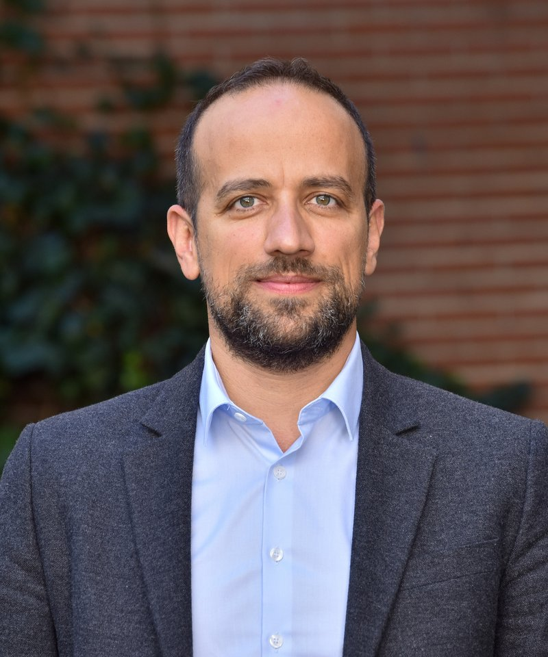

::: {.hero}
::: {.hero-photo}
{fig-alt="Portrait of Ata Can Bertay"}
:::

::: {.hero-text}
[Ata Can Bertay]{.hero-name .h1 style="display:block"}

[Assistant Professor of Finance]{.hero-role style="display:block"}
[Sabancı Business School, Sabancı University]{.hero-affil style="display:block"}

I am an Assistant Professor of Finance at Sabancı Business School, Sabancı University, and a researcher at the European Banking Center, Tilburg University. My research studies banking, financial stability, macro-finance and corporate governance, with recent work on the finance wage premium, gender and finance, and how new technologies affect credit markets.

In 2025–2026 I was a Senior Lecturer in Finance at Stockholm University, where students gave me the Ballerina Award for exceptional teaching. Before joining Sabancı in 2019, I was a Research Economist in the World Bank's Development Research Group (2015–2019) and lead author of the Global Financial Development Report 2017/2018 and 2019/2020. I directed the Sabancı University Corporate Governance Forum from 2021 to 2025 and have consulted for the World Bank, the EBRD and the Inter-American Development Bank. I hold a PhD in Economics from Tilburg University.

::: {.hero-links}
[CV](files/cv.pdf){.primary}
[Google Scholar](https://scholar.google.com/citations?user=QEAmeegAAAAJ&hl=en)
[SSRN](https://papers.ssrn.com/sol3/cf_dev/AbsByAuth.cfm?per_id=1534021)
[IDEAS/RePEc](https://ideas.repec.org/f/pbe694.html)
[ORCID](https://orcid.org/0000-0003-2945-7832)
[LinkedIn](https://tr.linkedin.com/pub/ata-can-bertay/19/9a8/170/)
[X](https://x.com/atabertay)
:::
:::
:::

## Research interests

[Banking · Financial stability · Macro-finance · Corporate governance · Financial development · Labor and finance]{.interests}

## News

::: {.news}
- [Sep 2026]{.when} Back at Sabancı Business School after a year as Senior Lecturer in Finance at Stockholm University.
- [Jul 2026]{.when} New working paper: "Firm Automation and Cost of Lending: Micro Insights for an Emerging Market," CRBF Working Paper 27-003. [PDF](files/bertay-et-al-2026-firm-automation.pdf)
- [Jun 2026]{.when} "Decomposing the Finance Wage Premium: Contributions of Technology and Risk" published in the *Journal of Corporate Finance*. [Paper](https://doi.org/10.1016/j.jcorpfin.2026.102980)
- [2026]{.when} "Does Workforce Gender Diversity Influence Banks' High-level Decisions?" published in *Emerging Markets Finance and Trade*. [Paper](https://doi.org/10.1080/1540496X.2026.2713727)
- [2026]{.when} Received the Ballerina Award for Exceptional Pedagogical Ability, Stockholm Business School.
- [May 2025]{.when} "Gender Inequality and Economic Growth: Evidence from Industry-Level Data" published in *Empirical Economics*. [Paper](https://doi.org/10.1007/s00181-024-02698-6)
- [Apr 2025]{.when} Received the Science Academy Young Scientist Award (BAGEP) in Economics.
:::

## Honors

::: {.news}
- [2026]{.when} Ballerina Award for Exceptional Pedagogical Ability, Stockholm Business School, Stockholm University (student-nominated)
- [2025]{.when} Science Academy Young Scientist Award (BAGEP) in Economics
- [2020]{.when} World Bank DEC VPU Team Award
- [2015]{.when} Turkishtime "40 Star Economists Under 40"
:::

## Contact

::: {.contact}
Email: [](mailto:)

Sabancı Business School, Sabancı University\
Orta Mahalle, 34956 Tuzla, Istanbul, Türkiye
:::
